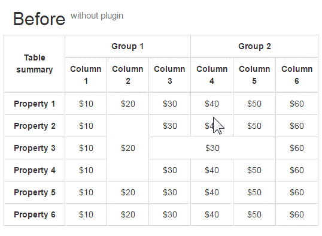

# TableCellsSelection - jQuery plugin for intuitive table's cells selection (like Excel or Google Docs)

This jQuery plugin for emulate rectangular highlighting cells on selection .

Make highlighting cells as it happens in GoogleDocs or Excel e.q. Can be useful in WYSIWYG editors.



# Usage
* Add stylesheet on your html page
```html
	<link rel="stylesheet" href="tablecellsselection.css">
```
* Include tablecellsselection.js before closing tag body
```html
	<script src="tablecellsselection.js"></script>
```
*  Apply this plugin to any tables
```javascript
	jQuery(document).ready(function($) {
		$('.tables-with-selection').tableCellsSelection();
	});
```

# TableCellsSelection API

 - `init` - apply plugin to jQuery object. Add plugin's classes and attach event handlers to selected tables.
 - `destroy` - delete cells selection functionality from selected tables. Delete plugin's classes and detach events listenters.
 - `selectedCells` - return selected cells as jQuery-object.
 - `removeDocumentHtmlChanges` - revert all HTML DOM changes, made by plugin. May be helpfull for call by wisiwig-editor's on save() method for clear markup.

 TODO:
 - `addDocumentHtmlChanges` - apply HTML DOM changes, required by plugin to work.

## Example of usage API
```javascript
//Apply plugin to selected tables.
$('.tables-with.selection').tableCellsSelection();//equal to  `$('.tables-with.selection').tableCellsSelection('init');`
var testTable = $('#test');

//select some cells in table#test

//Get selected cells in #test table.
var $selectedCells = $('#test').tableCellsSelection('selectedCells');

//Before get table html-content clear markup from plugin changes.
testTable.tableCellsSelection('removeDocumentHtmlChanges');

//Get table html-content
$testTableContent = testTable.html();

//Restore HTML changes required by plugin to work.

//Make table cells not intuitive selectable
testTable.tableCellsSelection('destroy');

//включение обработки обьединенных ячеек 'coordinateManipulateMagic':true
//отключение суммирования ячеек 'selectionSum':false
$('#tablecellsselection').tableCellsSelection({'coordinateManipulateMagic':true,'selectionSum':false});
//При использовании bootstrap grid не правильно работает позиционирование блока с суммой ячеек (уезжает вниз и влево)
```

# Appreciation

This is a almost completely rewritten version of [cells-selector plugin](http://cells-selector.02-web.ru/)

#TODO
- Integrate with browseer's selection API (if possible).
- Implement valid table cells/columns/rows selection/deselection.
- Implement valid `addDocumentHtmlChanges` - apply HTML DOM changes, required by plugin to work.

# Licence
The MIT License (MIT).
